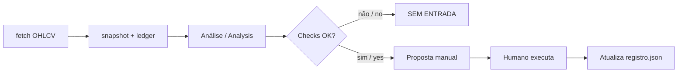

# Analista Cripto Spot

[](LICENSE)
[](cripto/motor_cripto.py)
[](#)
[](#)

**PT:** Mesa de análise para **Binance spot**: um motor verificável + skill de agente. Gera propostas; **você** confirma e executa.

**EN:** Binance **spot** analysis desk: a verifiable motor + agent skill. It proposes; **you** confirm and execute.

> ⚠️ Not financial advice. Spot only — no leverage, no shorts, no broker API keys, no automatic order placement.

---

## O que é / What it is

| PT | EN |
| --- | --- |
| Motor Python (`motor_cripto.py` v3.1.0) com setups pullback e breakout | Python motor (v3.1.0) with pullback & breakout setups |
| Regras executáveis em `REGRAS.md` | Executable rules in `REGRAS.md` |
| Skill para agentes em `skills/analista-cripto-spot/` | Agent skill under `skills/analista-cripto-spot/` |
| Ledger só com fills **confirmados** | Ledger with **confirmed** fills only |
| Rodadas sugeridas: 08:00 / 17:30 / 21:10 (`America/Sao_Paulo`) | Suggested rounds: 08:00 / 17:30 / 21:10 (`America/Sao_Paulo`) |

## O que não é / What it is not

- ❌ Bot de corretora / exchange trading bot  
- ❌ Alavancagem, futuros ou shorts / leverage, futures, or shorts  
- ❌ Sinais inventados sem dados do motor / invented signals without motor data  

---

## Fluxo / Flow



---

## Quick start

```bash
git clone https://github.com/Raphael-Queiroz/analista-cripto-spot.git
cd analista-cripto-spot/cripto

python3 motor_cripto.py --config configuracao.json fetch --data dados
python3 motor_cripto.py --config configuracao.json snapshot \
  --data dados --ledger registro.json --output resultados/snapshot.json
```

Use a skill-capable agent with `skills/analista-cripto-spot/SKILL.md`, or read the snapshot JSON yourself.

---

## Estrutura / Structure

```
analista-cripto-spot/
├── LICENSE
├── README.md
├── CONTRIBUTING.md
├── skills/analista-cripto-spot/SKILL.md
└── cripto/
    ├── motor_cripto.py
    ├── configuracao.json
    ├── REGRAS.md
    ├── INSTRUCAO.md
    ├── registro.json          # empty template
    ├── dados/                 # runtime (gitignored)
    └── resultados/            # runtime (gitignored)
```

---

## Contribuir / Contributing

Forks e PRs são bem-vindos. Veja [CONTRIBUTING.md](CONTRIBUTING.md).

Forks and PRs welcome — see [CONTRIBUTING.md](CONTRIBUTING.md).

---

## Licença / License

[MIT](LICENSE) © 2026 Raphael Queiroz
